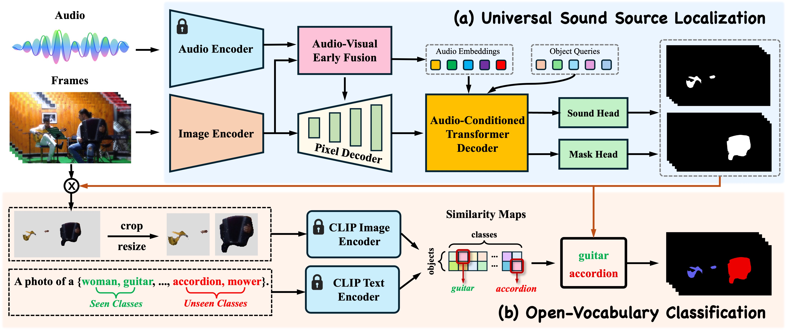
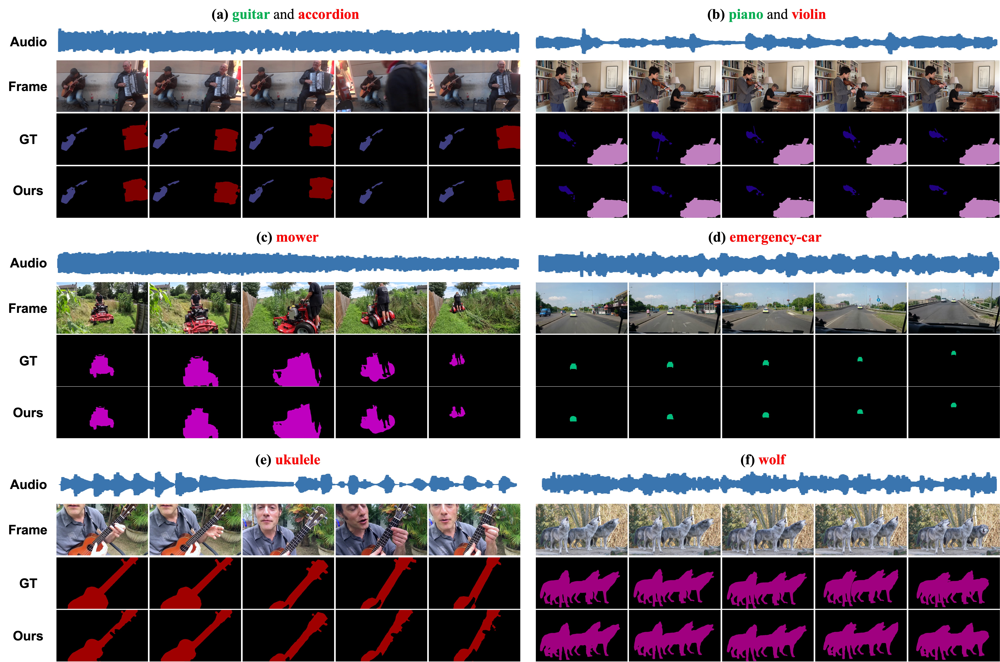

# Open-Vocabulary Audio-Visual Semantic Segmentation (ACM MM 24 Oral)

Ruohao Guo, Liao Qu, Dantong Niu, Yanyu Qi, Wenzhen Yue, Ji Shi, Bowei Xing, Xianghua Ying*

[`PDF`]() | [`CODE`](https://github.com/ruohaoguo/ovavss) | [`Cite`](https://github.com/ruohaoguo/ovavss?tab=readme-ov-file#citation)


## News

**25.07.2024:** Our paper is accepted by **ACM MM 2024** as **Oral**!  


## Introduction

<div align="center">
  
</div><br/>

Audio-visual semantic segmentation (AVSS) aims to segment and classify sounding objects in videos with acoustic cues. However, most approaches operate on the close-set assumption and only identify pre-defined categories from training data, lacking the generalization ability to detect novel categories in practical applications. In this paper, we introduce a new task: open-vocabulary audio-visual semantic segmentation, extending AVSS task to open-world scenarios beyond the annotated label space. This is a more challenging task that requires recognizing all categories, even those that have never been seen nor heard during training. Moreover, we propose the first open-vocabulary AVSS framework, OV-AVSS, which mainly consists of two parts: 1) a universal sound source localization module to perform audio-visual fusion and locate all potential sounding objects and 2) an open-vocabulary classification module to predict categories with the help of the prior knowledge from large-scale pre-trained vision-language models. To properly evaluate the open-vocabulary AVSS, we split zero-shot training and testing subsets based on the AVSBench-semantic benchmark, namely AVSBench-OV. Extensive experiments demonstrate the strong segmentation and zero-shot generalization ability of our model on all categories. On the AVSBench-OV dataset, OV-AVSS achieves 55.43% mIoU on base categories and 29.14% mIoU on novel categories, exceeding the state-of-the-art zero-shot method by 41.88%/20.61% and open-vocabulary method by 10.2%/11.6%.

<div align="center">
  
</div><br/>

## Installation

### Example 1
```bash
conda create -n ov_avss python==3.8 -y
conda activate ov_avss

git clone https://github.com/ruohaoguo/ovavss
cd ovavss

pip install torch torchvision
git clone https://github.com/facebookresearch/detectron2.git
python -m pip install -e detectron2

pip install -r requirements.txt

pip install git+https://github.com/openai/CLIP.git
pip install -e third_parties/mask_adapted_clip 

cd ov_avss/modeling/pixel_decoder/ops
bash make.sh

pip install git+https://github.com/sennnnn/TrackEval.git
```

### Example 2
```bash
conda create -n ov_avss python==3.8 -y
conda activate ov_avss

git clone https://github.com/ruohaoguo/ovavss
cd ovavss

conda install pytorch==1.9.0 torchvision==0.10.0 cudatoolkit=11.1 -c pytorch -c nvidia
pip install -U opencv-python
git clone https://github.com/facebookresearch/detectron2
cd detectron2
pip install -e .

cd ..
pip install -r requirements.txt
pip install git+https://github.com/openai/CLIP.git
pip install -e third_parties/mask_adapted_clip

cd ov_avss/modeling/pixel_decoder/ops
bash make.sh

pip install git+https://github.com/sennnnn/TrackEval.git
```

## Setup

1. Download pretrained weight [model_final_3c8ec9.pkl](https://dl.fbaipublicfiles.com/maskformer/mask2former/coco/instance/maskformer2_R50_bs16_50ep/model_final_3c8ec9.pkl) and put it in ```./pre_models```.
2. Download pretrained weight [model_final_83d103.pkl](https://dl.fbaipublicfiles.com/maskformer/mask2former/coco/instance/maskformer2_swin_base_IN21k_384_bs16_50ep/model_final_83d103.pkl) and put it in ```./pre_models```.
3. Download pretrained weight [vggish-10086976.pth](https://pan.baidu.com/s/1deNQvX99YiSCRwOxDHL3hg) (code: 1234) and put it in ```./pre_models```.
4. Download and unzip [datasets](https://pan.baidu.com/s/1DaXe2JsWDxpZjJ12tIcQzA) (code: 1234) and put it in ```./datasets```.


## Training

- For ResNet-50 backbone: Run the following command
  ```
  python train_net.py \
      --config-file configs/avsbench/OV_AVSS_R50.yaml \
      --num-gpus 1
  ```

- For Swin-base backbone: Run the following command
  ```
  python train_net.py \
      --config-file configs/avsbench/swin/OV_AVSS_SwinB.yaml \
      --num-gpus 1
  ```


## Inference & Evaluation

- For ResNet-50 backbone: Run the following command

- Download the trained model [model_ov_avss_r50.pth](https://pan.baidu.com/s/1ZLmvfvLKyVMw8jM8IceAeQ) (code: 1234) an put it in ```./pre_models```.

  ```
  cd demo_video
  python test_net_video_avsbench_r50.py
  ```

- For Swin-base backbone: Run the following command

- Download the trained model [model_ov_avss_swinb.pth](https://pan.baidu.com/s/1u8rjJTCq-LrwdZYIzTscvw) (code: 1234) an put it in ```./pre_models```.

  ```
  cd demo_video
  python test_net_video_avsbench_swinb.py
  ```

- **Note**: The results tested on [Example 1](https://github.com/ruohaoguo/ovavss?tab=readme-ov-file#example-1) and [Example 2](https://github.com/ruohaoguo/ovavss?tab=readme-ov-file#example-2) have a slight performance difference.

## FAQ

If you want to improve the usability or any piece of advice, please feel free to contant directly (ruohguo@foxmail.com).


## Citation

Please consider citing our paper in your publications if the project helps your research. BibTeX reference is as follow.

```

```

## Acknowledgement

This repo is based on [OpenVIS](https://github.com/clownrat6/OpenVIS), [Mask2Former](https://github.com/facebookresearch/Mask2Former) and [detectron2](https://github.com/facebookresearch/detectron2) Thanks for their wonderful works.
